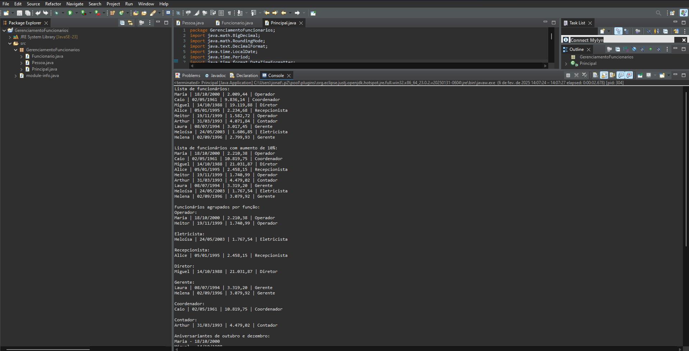

# Gerenciamento de Funcionários

Este projeto é uma aplicação Java que demonstra o gerenciamento básico de funcionários em uma empresa.

## Preview

<table width="100%"> 
<tr>
<td width="100%">

</td> 
</table>

## Descrição

O programa realiza as seguintes operações:
1. Insere uma lista de funcionários
2. Remove um funcionário específico
3. Imprime a lista de funcionários
4. Aplica um aumento de 10% nos salários
5. Agrupa e imprime funcionários por função
6. Identifica aniversariantes de outubro e dezembro
7. Encontra o funcionário mais velho
8. Ordena e imprime a lista de funcionários por ordem alfabética
9. Calcula e imprime o total dos salários
10. Calcula quantos salários mínimos cada funcionário ganha

## Requisitos do Sistema

- Java Development Kit (JDK) 8 ou superior
- Ambiente de execução Java (JRE) 8 ou superior

## Como Executar

1. Certifique-se de que você tem o Java instalado em seu sistema.
2. Abra um terminal ou prompt de comando.
3. Navegue até o diretório onde o arquivo JAR está localizado.
4. Execute o seguinte comando:

   java -jar GerenciamentoFuncionarios.jar

5. O programa será executado e os resultados serão exibidos no console.

## Estrutura do Projeto

O projeto consiste em três classes principais:

1. Pessoa.java: Classe base que representa uma pessoa com nome e data de nascimento.
2. Funcionario.java: Classe que estende Pessoa, adicionando atributos de salário e função.
3. Principal.java: Classe principal que contém o método main e toda a lógica de execução do programa.

## Funcionalidades

- Manipulação de datas usando a API java.time
- Uso de Streams e Lambdas para processamento de coleções
- Formatação de valores monetários
- Cálculos com BigDecimal para precisão em operações financeiras
- Agrupamento e ordenação de dados

## Observações

- Os salários são calculados e exibidos com duas casas decimais.
- A data de nascimento é exibida no formato dd/MM/yyyy.
- O salário mínimo utilizado para cálculos é R$ 1.212,00.

## Autor

Jonathan de Oliveira Rocha

## Data

06/02/2025
